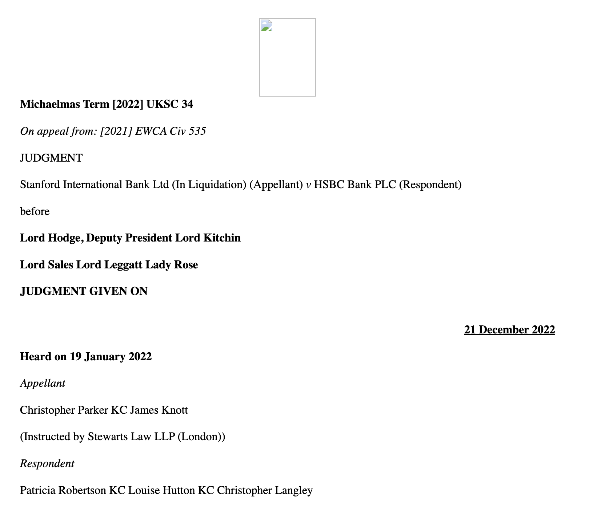

## Try out the UK National Archives' Parser 
I'm trying out the [UK National Archives' judgment parser](https://github.com/nationalarchives/tna-judgments-parser) and thought a repo might be helpful for others who are keen on giving it a go too. Thank you to the National Archives for having a REST API that's available for people who are curious!

The parser turns judgments, received by as Word .docx files to XML, conforming to the LegalDocML (Akoma Ntoso) schema [^1].

[^1]: See [here](https://www.digitalmarketplace.service.gov.uk/digital-outcomes-and-specialists/opportunities/16224) at "Any work that's already been done". I believe that the parser they discuss here is the one that's at the Github repo I linked.

**Quick way to try out the parser:**
1. Go to https://parse.judgments.tna.jurisdatum.com/ 
2. Upload a UK court judgment in .docx format. I've included a sample in this repo for you to try out. I downloaded a PDF from the UKSC and converted it to Word format with ilovepdf.com's converter. 
3. Profit! View judgment.xml or preview how it'll look as HTML. 

**HTML view of the sample judgment (Stanford Intl Bank (in Liquidation) v HSBC Bank PLC)**

XML can be viewed under the .xml file in this repo. 